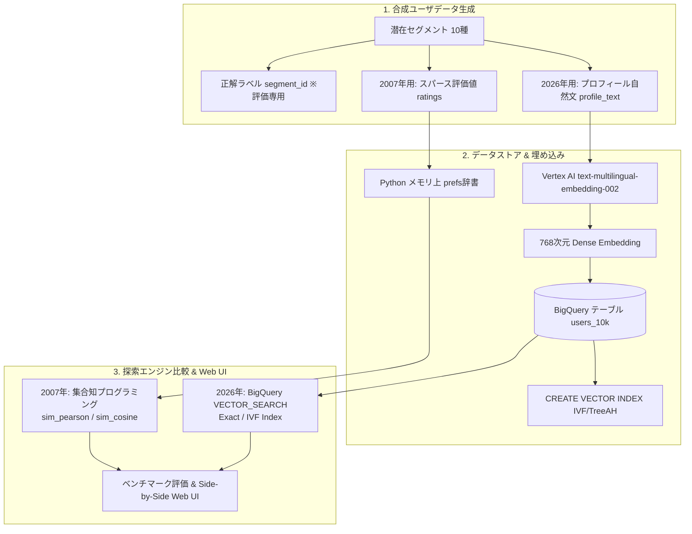

# pci-to-vector-search: 似ているユーザ探索の19年

> **「似ているユーザ」を探す処理を、名著『集合知プログラミング』（2007）の手書き協調フィルタリングと、Google Cloud BigQuery `VECTOR_SEARCH`（2026）で並べて比較・検証するリポジトリ**

---

## 📖 はじめに (Context & Respect)

2007年に出版されたオライリー・ジャパンの名著『集合知プログラミング』（Programming Collective Intelligence, Toby Segaran 著）第2章「推薦エンティティの作成」は、協調フィルタリングとユーザ類似度計算の原理を学ぶ世界的な名著です。

一方で、2020年代半ばの現代において実務で語られる「類似ユーザ検索」は、LLMやEmbeddingモデルによる稠密ベクトル（Dense Embedding）と、BigQuery `VECTOR_SEARCH` や Vertex AI Vector Search（ScaNN）などの近似最近傍探索（ANN）インデックスを組み合わせたクラウドネイティブな構成へと進化しました。

本書のアルゴリズムは意図的に美しく単純化されており、本リポジトリはその省略された先——**スパース評価値と埋め込みの断絶、インデックス閾値、共通項限定計算の落とし穴、推薦結果の一致度と再現率の計測**——を自分で追ってみた検証記録です。

---

## 🏗 全体アーキテクチャ & データ設計

客観的な精度評価を行うため、**10種類の潜在ユーザセグメント（ペルソナ）** を定義し、同一セグメントから「2007年用データ」と「2026年用データ」を派生させた合成ユーザデータ（10,000件）を生成しています。



### ユーザセグメント（正解ペルソナ 10種）
1. `tech_early_adopter`: 先端テック・アーリーアダプター
2. `frugal_family_organizer`: 子育て節約・家計管理層
3. `urban_single_gourmet`: 都心単身・美食・カルチャー派
4. `outdoor_camp_enthusiast`: 本格アウトドア・キャンプ愛好家
5. `wellness_senior_active`: 健康長寿・アクティブシニア層
6. `subculture_anime_gamer`: サブカル・アニメ・ゲーマー層
7. `fitness_bodybuild_runner`: フィットネス・筋トレ・ランナー層
8. `beauty_trend_fashionista`: 美容・トレンドファッション層
9. `diy_craft_creator`: DIY・クラフト・モノづくり愛好家
10. `executive_business_leader`: エグゼクティブ・ビジネスリーダー層

---

## 🎯 ベンチマーク実測結果 (10,000ユーザ)

Google Cloud プロジェクト `marine-access-331406` (BigQuery `asia-northeast1`) 上で実測したベンチマーク結果です。

### 1. 精度 (Precision@K) & レイテンシ比較

| 探索手法 | 精度 Precision@5 (セグメント一致率) | 精度 Precision@10 (セグメント一致率) | 平均レイテンシ | P95 レイテンシ | 特徴・計算量 |
| :--- | :---: | :---: | :---: | :---: | :--- |
| **1. PCI 2007 (Pearson 相関)** | **41.3%** | **40.7%** | 38.4 ms | 46.3 ms | 中心化Cos / 共通評価アイテム限定 $O(N)$ |
| **2. PCI 2007 (Cosine 共通項)** | **36.0%** | **20.0%** | 21.7 ms | 23.5 ms | 書籍準拠 / 共通評価アイテム限定 |
| **3. PCI 2007 (Cosine ゼロ埋め)** | **100.0%** | **100.0%** | 23.5 ms | 27.5 ms | 全アイテム空間での疎ベクトルCos |
| **4. BQ 2026 (VECTOR_SEARCH ブルートフォース)** | **100.0%** | **100.0%** | 1,114.7 ms | 2,159.5 ms | 厳密全件スキャン（Exact Search） |
| **5. BQ 2026 (VECTOR_SEARCH IVF インデックス)** | **100.0%** | **100.0%** | 1,008.4 ms | 1,178.1 ms | 近似最近傍探索（ANN） |

### 2. 手法間の一致度 (Top-10 Jaccard Overlap)

| 探索手法 | 1. PCI Pearson | 2. PCI Cos 共通項 | 3. PCI Cos ゼロ埋め | 4. BQ Exact | 5. BQ IVF Index |
| :--- | :---: | :---: | :---: | :---: | :---: |
| **1. PCI Pearson** | **100.0%** | 0.0% | 0.0% | **0.4%** | **0.4%** |
| **2. PCI Cos 共通項** | 0.0% | **100.0%** | 0.0% | 0.0% | 0.0% |
| **3. PCI Cos ゼロ埋め** | 0.0% | 0.0% | **100.0%** | **0.4%** | **0.4%** |
| **4. BQ Exact** | 0.4% | 0.0% | 0.4% | **100.0%** | **55.7%** |
| **5. BQ IVF Index** | 0.4% | 0.0% | 0.4% | 55.7% | **100.0%** |

---

## 💡 重要な技術的洞察 (Key Takeaways)

### ① スパース性における「共通項限定計算」の罠
『集合知プログラミング』で紹介されている素朴なピアソン相関やコサイン類似度は、「2人が共通して評価したアイテムのみ」を対象に計算します。
しかし、アイテム数が多くスパースな実データでは、**「たまたま共通評価した1〜2個のアイテムで評価値が一致した（例: 5.0 と 5.0）」だけで類似度が 1.0 (最大) に張り付く現象**が発生し、全く無関係なセグメントのユーザが上位を埋め尽くしてしまいます（Precision@5 が 36% に低下）。
未評価を0とする「ゼロ埋め疎ベクトル」に補正することで初めてセグメント正解率が 100% に回復します。

### ② 推薦結果の断絶（Jaccard Overlap = 0.4%）
2007年の「アイテム評価値（行動ログ）」に基づく手法と、2026年の「プロフィール文（自然言語埋め込み）」に基づく手法では、**Top-10推薦ユーザの重複率はわずか 0.4%** でした。
どちらも正解ペルソナ（Precision 100%）を引き当てているにもかかわらず、全く異なる個人が推薦されます。これは「行動のスパース性」と「言語の意味的近傍」が捉える情報の質が根本的に異なることを示しています。

### ③ BigQuery `CREATE VECTOR INDEX` の最小行数閾値
BigQuery のベクトルインデックス（IVF / TreeAH）は、**テーブル行数が 5,000行未満の場合は作成できません**（`Total rows is smaller than min allowed 5000 for CREATE VECTOR INDEX` エラー）。
小規模なPoCテーブルでは自動的にブルートフォース（厳密探索）となり、数万件以上の規模になって初めてインデックスの恩恵が得られます。

---

## 🖥 Side-by-Side 比較 Web アプリケーション

同一ユーザを選択すると、2007年手法と2026年手法の探索結果・類似度・セグメント正解判定がリアルタイムに左右比較表示されます。

```bash
# Webアプリの起動
PYTHONPATH=. uvicorn src.web.app:app --host 127.0.0.1 --port 8000 --reload
```
ブラウザで `http://localhost:8000` にアクセスしてください。

---

## 🚀 クイックスタート & 再現手順

### 1. 前提条件 & 依存関係のインストール
```bash
# Google Cloud ADC認証
gcloud auth application-default login

# ライブラリのインストール
pip install -r requirements.txt
```

### 2. 合成ユーザデータの生成
```bash
# 10,000件のユーザデータ生成
python3 src/data/generate_dataset.py --n_samples 10000 --output data/users_10k.jsonl
```

### 3. Vertex AI 埋め込み生成 & BigQuery ロード
```bash
python3 src/bq/bq_setup.py \
  --project_id marine-access-331406 \
  --location asia-northeast1 \
  --dataset_id pci_vector_search \
  --table_name users_10k \
  --input_jsonl data/users_10k.jsonl
```

### 4. ベンチマークの実行
```bash
PYTHONPATH=. python3 src/benchmark/run_benchmark.py \
  --jsonl data/users_10k.jsonl \
  --num_users 20 \
  --top_k 10 \
  --table_name users_10k
```

---

## 📂 ディレクトリ構成

```
pci-to-vector-search/
├── README.md                  # 本ドキュメント
├── benchmark_report.md        # ベンチマーク実測レポート
├── requirements.txt           # 依存パッケージ定義
├── data/
│   ├── users_10k.jsonl        # 生成された10,000件のユーザデータ
│   └── users_10k_embedded.jsonl # 埋め込みキャッシュ
├── src/
│   ├── data/
│   │   ├── segments.yaml      # 10種のユーザペルソナ定義
│   │   └── generate_dataset.py # 合成データ生成スクリプト
│   ├── classic/
│   │   └── classic_recommender.py # 2007年 集合知プログラミング協調フィルタリング
│   ├── bq/
│   │   ├── bq_setup.py        # Vertex AI Embeddings & BQロード・インデックス作成
│   │   ├── bq_search.py       # BigQuery VECTOR_SEARCH クライアント
│   │   └── vector_search.sql  # SQLクエリテンプレート
│   ├── benchmark/
│   │   └── run_benchmark.py   # 精度・レイテンシ・手法間一致度ベンチマーク
│   └── web/
│       ├── app.py             # FastAPI バックエンド
│       └── templates/
│           └── index.html     # Side-by-Side 比較画面
```

---

## 📜 ライセンス

MIT License
